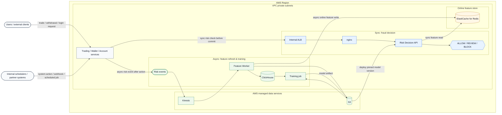
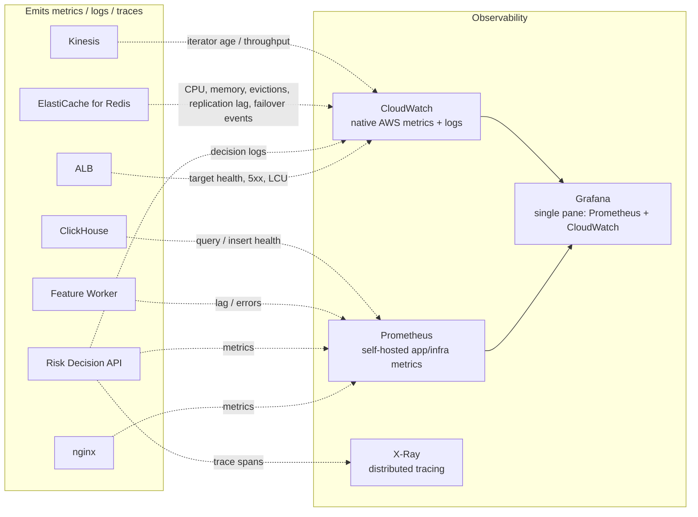
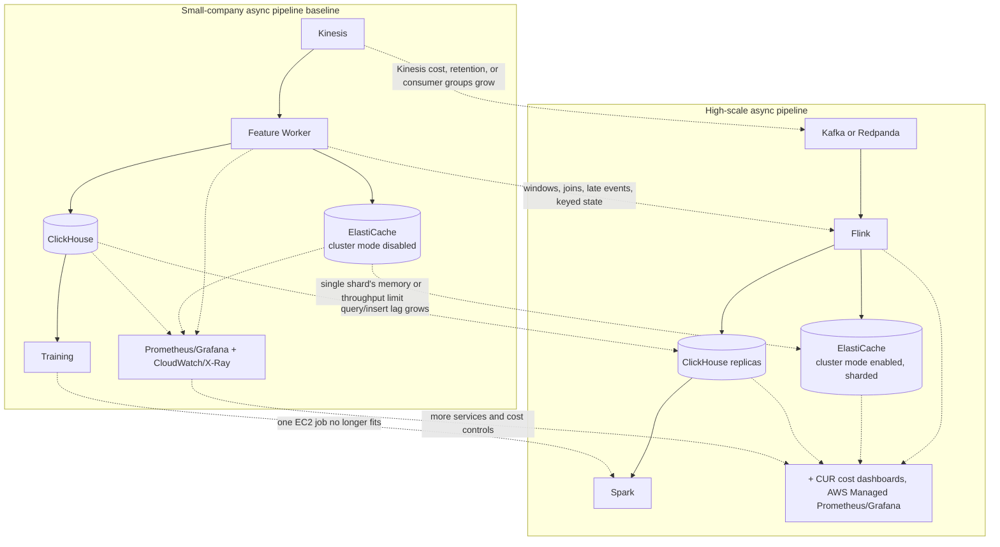

# Problem 1 — Real-Time ML Fraud Detection on AWS

> **Chosen feature slice:** a Binance-like platform needs real-time machine learning to
> detect suspicious account activity, withdrawals, P2P scams, and other high-risk
> actions before user funds leave the platform.
>
> The system returns `ALLOW`, `REVIEW`, or `BLOCK` with **500 RPS** throughput and
> **p99 < 100ms** response time.
>
> **Target:** fit a small company first — low monthly cost, small operational surface,
> no premature hyperscale services — with a clear, evidence-triggered path to high scale.
>


---

## Scope & assumptions


```
Can this user action continue right now?   →   ALLOW / REVIEW / BLOCK
```

Binance's own description of real-time fraud ML emphasizes **feature freshness** above
all: a model scoring against stale features can fail to stop a compromised account
before damage is done. That is why the architecture centers on a short online
prediction path, a streaming pipeline that updates features continuously, a low-latency
feature store, and a separate offline/batch path for training.


| Constraint (given) | Value |
|---|---|
| Cloud provider | AWS |
| Throughput | 500 requests/second |
| Response time | p99 < 100ms |

| Assumption | Value |
|---|---|
| Region | Single AWS region, two Availability Zones |
| Caller | Trading, wallet, or account service calls this service synchronously |
| Model | Small XGBoost/LightGBM-style model, loaded in-process |
| Feature freshness target | p99 < 2s from event to Redis |
| Financial source of truth | Existing wallet/ledger/order systems, not this service |
| Failure stance | Fail to `REVIEW`, never blind `ALLOW` |

---

## Part 1 — Architecture overview

### 1.1 System diagram



The diagram has two paths. The **sync path** is the request-time path: the user action
waits for the Risk Decision API to read Redis, score the request, and return ALLOW,
REVIEW, or BLOCK. The **async path** runs continuously in the background: events update
Redis and ClickHouse, then feed batch training and model artifacts.

The trading, wallet, and account services live inside the VPC and are triggered by user
requests, partner callbacks, scheduled jobs, or internal system actions. They have two
responsibilities: call the sync risk check before committing a high-risk action, and
emit async risk events after product actions such as order placement, withdrawal, login,
device change, API-key change, or profile change.

### 1.2 Observability diagram

Pulled out as its own diagram rather than crowding the architecture diagram above —
every synchronous- and asynchronous-path component in §1.1 emits into one of three
collectors, which Grafana renders as a single pane.



**Correction from the previous revision:** ALB, Kinesis, and ElastiCache do not expose a
Prometheus-scrapable endpoint — their metrics live natively in CloudWatch. Now that Redis
runs as ElastiCache rather than self-hosted on EC2, its metrics move to the same
CloudWatch path as the other two managed services.

Observability is deliberately not just Prometheus and Grafana. Prometheus covers
metrics on the pieces this design still self-hosts (nginx, Risk API, worker,
ClickHouse); CloudWatch covers native AWS service metrics that Prometheus cannot scrape
(ALB, Kinesis, ElastiCache) plus centralized decision logs; X-Ray gives sampled tracing
across the five-hop synchronous path. See §2.10 for why each piece is there, and what
alerting is deliberately not covered here.

### 1.3 Component roles

| Component | Role | Placement |
|---|---|---|
| ALB | Internal managed ingress, multi-AZ health checks, listener routing | VPC private subnets, 2 AZ |
| nginx (EC2) | Load shedding, buffering, upstream keepalive, ms-level timeouts, degraded-mode fallback | VPC private subnets, ASG, 2 AZ |
| Risk Decision API | Rules engine + in-process ML inference → decision | ECS on EC2 Graviton, private subnets, 2 AZ |
| ElastiCache for Redis | Online feature store, sub-5ms reads, managed Multi-AZ failover | Managed, cluster mode disabled, 2 AZ |
| Kinesis | Durable, replayable event transport | Managed |
| Feature Worker | Stream consumer; materializes features | ECS on EC2 |
| ClickHouse (EC2) | Offline analytical store, historical features; not in the hot path | Private subnet |
| S3 (data) | Raw event archive, model artifacts, ClickHouse cold tier | Managed |
| EC2 Spot | Model training jobs | Batch |
| Prometheus | Self-hosted app/infra metrics (nginx, Risk API, worker, ClickHouse) | ECS |
| CloudWatch | Native AWS service metrics (ALB, Kinesis, ElastiCache) + centralized decision logs | Managed |
| X-Ray | Distributed tracing across the synchronous path | Managed |
| Grafana | Single-pane dashboards over Prometheus + CloudWatch | ECS |

### 1.4 Monitoring signals and actions

Prometheus scrapes self-hosted components; CloudWatch holds native AWS service metrics
and decision logs; X-Ray samples requests across the five hops of the synchronous path.
Grafana is the single pane over both metric sources. Alerting/paging is not covered by
this design pass — see §2.10 for what that leaves open.

| Area | Metrics to collect | Source | Action when bad |
|---|---|---|---|
| API SLO | request rate, p50/p95/p99 latency, 4xx/5xx, timeout count | Prometheus | Scale Risk API tasks/nodes; if timeout spike, return `REVIEW` instead of waiting |
| ALB | target health, target response time, 5xx, LCU usage | CloudWatch | Replace unhealthy targets; tune payloads/connection reuse if LCU cost grows |
| nginx | active connections, upstream failures, queueing, rate-limit drops | Prometheus | Add nginx instances; tighten load shedding or upstream timeouts |
| ECS/EC2 | CPU, memory, restarts, task count, autoscaling events | Prometheus/CloudWatch | Add capacity; rollback bad deployment; rebalance tasks across AZs |
| Redis | command p99, memory used, evictions, replication lag, failover events | CloudWatch | Enter rules-only/`REVIEW` during failover; add read replicas; move to cluster mode enabled (sharded) if a single shard's memory/throughput is the actual limit |
| Feature freshness | event-to-Redis p99, stale-feature rate, missing-feature rate | Prometheus | Downgrade risky requests to `REVIEW`; add workers; inspect stream lag |
| Kinesis | incoming bytes/records, throttles, iterator age | CloudWatch | Add shards; reduce event size; let workers replay backlog |
| Feature worker | consumer lag, processing latency, error rate, Redis/ClickHouse write latency | Prometheus | Scale workers; pause bad feature rollout; replay from checkpoint |
| ClickHouse | disk free, insert latency, rejected inserts, query p95, merge backlog | Prometheus | Scale disk/CPU; pause heavy queries; restore/rebuild from S3 if node fails |
| Cross-hop latency | sampled traces showing which hop owns the tail | X-Ray | Isolate the offending hop instead of guessing from aggregate p99s |
| Decision audit | structured log per decision: features used, rule fired, model version, outcome | CloudWatch Logs | Answer "why was this decision made" for disputes/compliance review |
| Model quality | model version age, score distribution drift, allow/review/block rate changes | ClickHouse (batch) | Roll back model; retrain; increase manual review threshold |
| Cost | cost per 1M decisions, EC2 utilization, Kinesis shard cost, data transfer | CloudWatch + CUR | Rightsize EC2; choose Savings Plans/Spot; move to Kafka/Redpanda only when cheaper at scale |

These are the signals that justify architecture changes. For example, Kinesis iterator
age means feature freshness is at risk, Redis p99 affects the synchronous SLO, and
ClickHouse disk pressure affects analytics/backfills but not live decisions.

Model quality is listed against ClickHouse, not Prometheus, on purpose: feature drift
and label-delayed metrics (a transaction is often only confirmed fraudulent days later,
via chargeback) are a scheduled batch computation, not something a real-time scrape
observes directly.

---

## Part 2 — Why each cloud service is used, and alternatives considered

### 2.1 Synchronous decision path — the budget every ingress/compute choice serves

```
ALB → nginx → Risk API → Redis → rules + in-process model → response
```

Fraud decisions are invoked directly by backend trading/wallet/account services. Every
choice in §2.2–2.3 exists to keep this path inside budget:

| Step | Target |
|---|---:|
| ALB → nginx | 1–2ms |
| nginx → Risk API | 1–2ms |
| request validation | 1–2ms |
| Redis feature fetch | 1–5ms |
| rules evaluation | 1ms |
| in-process model inference | 1–5ms |
| response write | 1–2ms |
| **expected p99** | **15–30ms** |
| **SLO** | **< 100ms** |

Rules that keep this budget honest: no ClickHouse query in the hot path, no S3 read in
the hot path, no Spark/Flink job in the hot path, no remote ML endpoint unless the model
outgrows in-process loading, Redis client timeout held aggressive (~10ms), and stale or
missing features always downgrade the decision to `REVIEW`.

### 2.2 API ingress — ALB + nginx on EC2

The Risk API uses an **internal ALB**, because its callers are backend trading, wallet,
and account services inside the platform network. It is not a public internet edge. ALB
handles managed ingress, multi-AZ target health checks, listener routing, and failover
without hand-built DNS or instance-discovery logic.

nginx sits behind ALB because it expresses controls ALB does not: `limit_req` load
shedding, request buffering, upstream keepalive, millisecond-level proxy timeouts, and a
conservative fallback response when every backend is down.

```nginx
limit_req_zone $http_x_api_key zone=perkey:10m rate=200r/s;
limit_req zone=perkey burst=100 nodelay;

proxy_connect_timeout 20ms;
proxy_read_timeout 60ms;
proxy_next_upstream error timeout http_502 http_503;
proxy_next_upstream_timeout 80ms;

resolver 169.254.169.253 valid=10s ipv6=off;
set $upstream risk-api.risk.local;
proxy_pass http://$upstream:8080;
```

These timeouts deliberately stay below the 100ms SLO. If the Risk API or Redis path is
slow, nginx should return a conservative `REVIEW` response instead of waiting long
enough to violate the caller's latency budget.

This combination is not cheaper than nginx alone, but it is more cost-effective for a
high-availability internal service: ALB removes fragile failover work while nginx still
enforces load shedding and the hard request deadline.

**Alternatives:**

| Option | Verdict |
|---|---|
| ALB alone | No load shedding, no sub-second timeout control, no upstream keepalive pool, no fallback when every task is down |
| Shed load in application code | A request that reaches the app has already cost a connection and a worker slot — shedding is only cheap at the edge |
| API Gateway | $1.00–3.50 per million requests → far more than nginx at this volume |
| nginx alone, no ALB | Inherits health checking, service discovery, and AZ failover by hand |

### 2.3 Compute — ECS on EC2 Graviton

Used instead of Fargate because this service is steady and always-on: no ECS
control-plane fee, direct control over instance size, API and worker containers can
share nodes, Graviton improves price/performance, and ECS still provides rolling
deployments, health checks, and service discovery.

| Alternative | Decision |
|---|---|
| Fargate | Simpler, but more expensive for steady baseline capacity |
| EKS | Too much operational surface for this size |
| Lambda | Cold starts and per-container model loading threaten p99 |
| Plain EC2 | Cheapest, but deployments and recovery become manual |

### 2.4 Online feature store — ElastiCache for Redis, cluster mode disabled

**Cluster mode disabled** means one shard: a single primary plus replicas, all holding
the full keyspace — no data sharding, no cluster-aware client needed, `HGETALL` just
works. That's the right shape here since one shard comfortably covers the feature
working set at 500 RPS; **cluster mode enabled** (sharded across multiple node groups)
is Part 3's move once a single shard's memory or throughput is the actual limit.

ElastiCache rather than self-hosting is chosen specifically for the failover mechanics,
not for the data model. A self-hosted primary/replica pair needs Sentinel to detect
failure and promote a replica, and Sentinel decides that by majority vote — split 3
Sentinels across only 2 AZs and one AZ necessarily holds 2 of the 3 votes, so losing
*that* AZ leaves the lone survivor unable to reach quorum and failover silently doesn't
happen, despite Redis "looking" multi-AZ. Fixing that properly needs a 3rd AZ carrying
just the tie-break vote. ElastiCache sidesteps the problem entirely: AWS's control
plane, not a customer-run quorum inside the same failure domain, monitors and promotes,
so Multi-AZ failover is correct with only 2 AZs and no Sentinel to operate.

Feature state is rebuildable from the event log and source systems if lost either way,
so the ElastiCache premium over bare EC2 isn't buying durability — it's buying correct
failover without a 3rd AZ or a self-run quorum, on a single small node.

**Alternatives:**

| Option | Verdict |
|---|---|
| Self-hosted Redis on EC2 (+ Sentinel) | Cheaper, but only safely multi-AZ with a 3rd AZ for the Sentinel quorum (see above) — otherwise it's a false sense of HA. Reasonable if the team wants that control and the extra AZ is acceptable |
| ElastiCache cluster mode enabled (sharded) | Deferred to Part 3 — one shard is comfortably enough at 500 RPS; sharding now would be paying for capacity and cross-slot complexity this workload doesn't need yet |
| MemoryDB for Redis | Adds multi-AZ durability (writes survive a full cluster restart), which this design doesn't need since features are rebuildable from Kinesis replay — paying for durability here is paying twice |
| DynamoDB as feature store | Single-digit-ms rather than sub-ms, and per-request pricing accumulates at continuous read volume; Redis fits the counter/last-value access pattern better |

### 2.5 Stream transport — Kinesis first, Kafka/Redpanda at high scale

Kinesis is the first event transport because it is managed and cheap enough at 500 RPS:

```
500 events/s × 1 KB  ≈  0.5 MB/s
```

One shard covers steady 500 RPS with little burst headroom. The first scaling move is
still Kinesis: scale to two or more shards once write utilization reaches 70%, iterator
age rises, or 800–1,000 RPS bursts become common.

Worth stating precisely, since it's a common confusion:

```
Kinesis / Kafka / Redpanda / NATS  =  event transport
Flink / Spark / ECS worker         =  processing
```

If Kinesis shard count, PUT volume, retention, or consumer-group needs become materially
expensive, the high-scale transport becomes Kafka or Redpanda on EC2. That is where
operating brokers can be cheaper than paying for more managed stream capacity. Flink or
Spark are not transport replacements; they still need Kinesis, Kafka, Redpanda, or
another event source underneath.

### 2.6 Stream processing — ECS worker first, Flink at high scale

V1 features are simple counters and last-known values:

```
withdrawal_count_1m, withdrawal_amount_10m, failed_login_count_1h,
new_device_seen, last_country, account_age_days
```

An ECS worker handles this comfortably. Introduce Flink when feature logic needs
event-time windows, watermarks, late-event handling, stream joins, deduplication with
checkpointed recovery, or large keyed state — not simply because volume grows.

The intended evolution is:

```text
Small company / 500 RPS:
    Kinesis -> ECS Feature Worker -> Redis / ClickHouse / S3

Growing product:
    Kinesis with more shards -> more ECS workers

High scale or complex real-time features:
    Kafka or Redpanda -> Flink -> Redis / ClickHouse / S3
```

### 2.7 Offline analytics — ClickHouse on EC2

Stores queryable history for analysts, model monitoring, and feature backfills: fast
aggregations, high compression, lower cost than Redshift for V1, and rebuildable from S3
raw events if lost. Add OpenSearch later if investigators need entity search across
device IDs, wallet addresses, IPs, emails, or fuzzy text — a different query shape than
ClickHouse serves well.

The V1 ClickHouse node is **not highly available by itself**. That is an intentional
cost trade-off because ClickHouse is not used in the synchronous fraud-decision path.
If it fails, online decisions continue from Redis and the existing model; analysts lose
fresh historical queries and backfills pause until restore finishes. Recovery comes from
EBS snapshots, ClickHouse backups, and S3 raw events. If the business needs ClickHouse
RTO measured in minutes instead of hours, the upgrade is two ClickHouse replicas across
AZs with `ReplicatedMergeTree` and ClickHouse Keeper, or a managed ClickHouse service.

### 2.8 Archive & batch ML — S3 + EC2 Spot

S3 holds raw events, ClickHouse exports/backups, model artifacts, and offline training
datasets — and is **not** the financial source of truth; wallet, ledger, and order
services own money state. Training starts on EC2 Spot; add Spark once a single node no
longer handles backfills, training-data generation, or large feature joins.

### 2.9 Resilience — why each component's failure mode is acceptable

The choice of each component also rests on what happens when it breaks. Governing rule:
**uncertainty becomes `REVIEW`, never blind `ALLOW`.**

| Failure | Behavior |
|---|---|
| ALB target unhealthy | ALB removes the failed nginx target |
| nginx instance fails | ALB routes to the healthy nginx in the other AZ |
| Risk API tasks unhealthy | nginx returns conservative `REVIEW` instead of waiting |
| Redis primary or one Redis AZ fails | ElastiCache automatic failover promotes a replica; API serves rules-only during failover |
| Redis unavailable during failover | Would-be `ALLOW` downgrades to `REVIEW` |
| Feature freshness exceeds target | Rules-only mode, and alert |
| Kinesis throttled | Decisions continue; scale shards, let workers catch up |
| Feature worker down | Kinesis retains events; replay on recovery |
| ClickHouse node/EBS lost | Online decisions continue; analytics/backfills pause; restore from snapshot/backups or rebuild from S3 raw events |
| Batch job fails | Online decisions continue on existing features/model |

### 2.10 Observability — Prometheus/Grafana, plus what metrics alone can't cover

Prometheus and Grafana are the right choice for the metrics layer: self-hosted, no
per-host/per-metric SaaS pricing, and they already sit on existing ECS capacity like the
rest of this design. But "monitoring" for a synchronous, cross-hop, financial-risk SLO
is more than metrics, and metrics alone leave three gaps this design closes, plus one
left open on purpose:

- **ALB and Kinesis aren't Prometheus-scrapable.** Their metrics live natively in
  **CloudWatch** — this also gives Grafana the second datasource it needs for the
  cost-per-1M-decisions KPI, which Prometheus cannot compute since it doesn't know the
  AWS bill (§2.11 pulls that from **AWS CUR**).
- **No tracing.** Aggregate per-component p99 (Prometheus) doesn't show whether the same
  requests are slow across multiple hops, which matters directly for a 5-hop, ~15-30ms
  budget. **X-Ray** is used with aggressive sampling: trace errors and a small
  percentage of successful requests, because tracing every request at 500 RPS would be
  wasteful and can exceed the free tier quickly.
- **No centralized logs**, which is also a compliance gap: a fraud decision needs an
  answer to "why was this blocked," not just a latency number. **CloudWatch Logs** holds
  the per-decision audit trail.

**Left open on purpose: no paging.** Alertmanager and CloudWatch Alarms were considered
and deliberately dropped from this design pass — dashboards exist, but nothing routes an
SLO breach to on-call automatically. That is a real gap for a 100ms financial-risk SLO;
it is accepted here rather than solved, and should not be mistaken for an oversight when
this design goes to production. Revisit once an on-call process and paging tool are
decided.

**Alternatives considered:**

| Option | Verdict |
|---|---|
| Loki for logs | Viable and pairs naturally with Grafana, but is another always-on self-hosted piece to operate. CloudWatch Logs is chosen to stay consistent with this design's "avoid another self-hosted platform" bias — revisit if log volume makes CloudWatch Logs pricing exceed self-hosting Loki |
| Datadog / New Relic | Per-host and per-custom-metric SaaS pricing typically exceeds this entire infrastructure bill at 500 RPS |
| AWS Managed Prometheus/Grafana (AMP/AMG) | Removes real operational burden (patching, storage, HA for the observability stack itself); reasonable to adopt once the observability stack itself starts generating incidents |
| Skip tracing, rely on per-component p99 only | Rejected: with a 100ms budget split five ways, aggregate percentiles can't distinguish "every hop is a bit slow" from "one hop is very slow for a subset of requests" |

### 2.11 Cost-efficiency summary

For a small company, cost efficiency also means the team can operate the system without
a large platform group — the baseline avoids heavy always-on platforms while keeping
direct upgrade paths.

| Area | Choice | Why |
|---|---|---|
| API ingress | Internal ALB + nginx on EC2 | Managed failover plus nginx's p99 controls |
| Compute | ECS on EC2 Graviton | Predictable resource control, lower steady cost than Fargate |
| Online features | ElastiCache for Redis, cluster mode disabled | Managed Multi-AZ failover without a self-run Sentinel quorum or 3rd AZ; single small shard keeps the premium modest |
| Stream transport | Kinesis, provisioned | Managed and cheap enough at 500 RPS |
| Stream processing | ECS worker | Simpler and cheaper than Flink for counters |
| Offline store | ClickHouse on EC2 | Cheap analytical scans and compression |
| Batch ML | EC2 Spot | Avoids always-on Spark/SageMaker cost |
| Ops state | DynamoDB, on-demand | Cheap for review queue / idempotency |
| Observability | Prometheus/Grafana + CloudWatch + sampled X-Ray | Avoids expensive SaaS monitoring baseline; tracing is sampled to control cost |

The largest savings do **not** come from removing ALB — they come from avoiding
Fargate, EKS, managed sharded Redis, MemoryDB, Redshift, SageMaker endpoints, API
Gateway, and always-on Flink/Spark before the workload actually needs them.

### 2.12 Deliberately left out

| Not included | Reason | Add when |
|---|---|---|
| Full matching engine | Different problem — this is fraud/risk ML | Scope changes |
| Real-time feature computation inside API | Raises p99, couples scaling | Only for tiny derived features |
| Flink | ECS worker handles V1 counters | Stateful stream processing becomes necessary |
| Spark | EC2 Spot handles V1 batch | Offline data no longer fits one node |
| SageMaker endpoint | Adds a network hop and fixed cost | Model too large/shared for in-process serving |
| Self-hosted Redis on EC2 | ElastiCache removes the Sentinel-quorum/3rd-AZ problem for a modest premium on one small shard | Team wants that control and staffing to operate Sentinel correctly |
| ElastiCache cluster mode enabled (sharded) | One shard covers 500 RPS comfortably | A single shard's memory or throughput becomes the limit — see Part 3 |
| Redshift | Too costly for V1 analytics | Warehouse-scale workload emerges |
| OpenSearch | ClickHouse covers aggregations | Entity search becomes important |
| Active-active multi-region | Expensive and complex | Business RTO/RPO requires it |
| Alertmanager / CloudWatch Alarms (paging) | Dashboards exist but nothing pages on-call automatically — accepted gap, not an oversight | On-call process and paging tool are decided |
| Loki / self-hosted logging | CloudWatch Logs avoids another always-on platform | CloudWatch Logs cost exceeds self-hosting Loki |
| Datadog / New Relic | Per-host SaaS pricing exceeds this infra bill at 500 RPS | Team needs a single vendor across many products |
| AWS Managed Prometheus/Grafana | Self-hosted is cheaper while the team can operate it | Observability stack itself starts generating incidents |

---

## Part 3 — Scaling plan

Part 3 shows how the Part 1 architecture scales. The baseline diagram stays simple on
purpose; the scale path is shown here instead.

### 3.1 Async pipeline scale diagram



The first move is still to scale **in place**: add capacity to the baseline components.
Only replace a component when its metric proves it has become the bottleneck.

### 3.2 500 RPS baseline

| Layer | Baseline |
|---|---|
| ALB | Internal API ingress |
| nginx | 2 small EC2 instances behind ALB |
| ECS | 2–3 Graviton nodes |
| Risk API | 2–4 tasks |
| Redis | ElastiCache, cluster mode disabled, Multi-AZ automatic failover |
| Event log | 1 Kinesis shard, scaled before sustained bursts |
| Worker | 1–2 ECS tasks |
| ClickHouse | Single EC2 node + EBS snapshots + S3 replay; recoverable, not HA |
| Training | EC2 Spot job |

### 3.3 Scale to ~2,000 RPS

At this stage the Part 1 architecture mostly stays the same. Scale the existing boxes
rather than introduce the high-scale replacements.

| Trigger | Move |
|---|---|
| API CPU > 60% or p99 rising | Add ECS tasks and nodes |
| nginx CPU or queueing rising | Add nginx instances, tune keepalive |
| ALB LCU cost rising | Review connection reuse, payload size, rule count |
| Redis p99 > 5ms | Add read replicas; move to cluster mode enabled (sharded) if a single shard's throughput is the actual limit |
| Stream utilization > 70% | Add Kinesis shards |
| Iterator age rising | Add workers, check downstream write latency |
| ClickHouse query/insert lag rising | Scale up or add replicas |
| ClickHouse restore time becomes unacceptable | Add 2 replicas across AZs with ClickHouse Keeper |

### 3.4 Scale beyond this design

This is where the high-scale boxes in the Part 3 diagram become real components.

| Pressure | Upgrade |
|---|---|
| Kinesis cost too high | Kafka/Redpanda/NATS on EC2 |
| Redis latency or memory pressure beyond one shard | ElastiCache cluster mode enabled (sharded) |
| Need Redis-compatible durability beyond a rebuildable cache | MemoryDB for Redis |
| Many models/teams | Dedicated feature platform (Feast/Tecton) |
| Rich investigation search needed | OpenSearch |
| Strict RTO/RPO | Multi-region active-passive, then active-active if justified |
| Many backend services | Service mesh or a stronger internal gateway |

### 3.5 Target-state summary

```
API ingress         → Internal ALB + nginx on EC2
Online prediction   → ECS Risk API + Redis + in-process ML model
Stream transport     → Kinesis first; Kafka/Redpanda later if cost demands
Stream processing    → ECS worker first; Flink later for stateful feature logic
Offline analytics    → ClickHouse on EC2
Batch ML             → EC2 Spot first; Spark later for large batch work
Archive/backups      → S3
Review/idempotency    → DynamoDB
Observability         → Prometheus + Grafana + CloudWatch (metrics/logs) + sampled X-Ray + CUR
```

The core of real-time fraud detection is keeping model features fresh while the online
prediction path stays short. The design center of gravity is the Binance-style pipeline:
stream events into an online feature store, serve those features to the model in real
time, and use batch computation for historical features and training.
