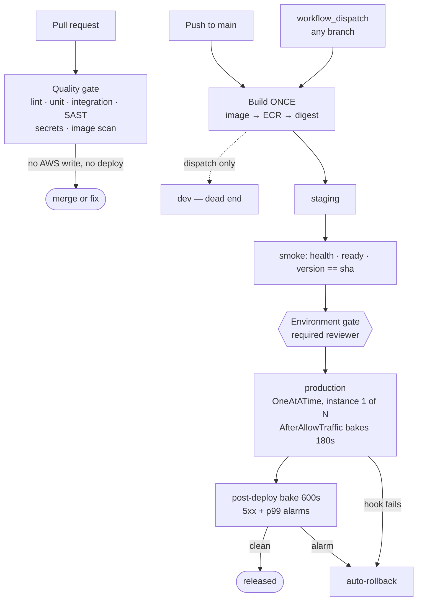

# Problem 4 — Ship It Twice

Two applications, two pipelines, one release mechanism: an HTTP API on EC2 and a static SPA
on S3, both released by hand today.

Part 1 is what this team should run now. Part 2 is what changes as it grows, with the
evidence that should trigger each change rather than a headcount or an RPS number.

## What I mean by "production ready"

The brief asks me to decide this, so I'll commit before the design — every trade-off below
is settled against it.

1. **What you tested is what you ship.** One artifact per commit, promoted by digest.
2. **A bad release is caught before it is fully rolled out.** Automated abort, not a dashboard.
3. **Recovery is faster than diagnosis.** Rollback is a workflow, not a runbook paragraph.
4. **No standing credentials.** OIDC only; there is no AWS key in GitHub to leak.
5. **Every production change has a named approver**, enforced by IAM rather than convention.
6. **It fails loudly.** Test reports as checks, plans as comments, alarms wired to rollback.

Not on the list: coverage as a target, a dashboard nobody opens, or a "canary" with no
automated abort.

## Assumptions

| # | Assumption | If it's wrong |
|---|---|---|
| 1 | Monorepo, `backend/` and `frontend/` at the root | Polyrepo works identically, minus the `paths:` filters |
| 2 | Backend ships as a container image run by systemd on EC2 | A tarball works with the same shape; only `after_install.sh` changes |
| 3 | VPC, ALB, ASG and the CodeDeploy service role already exist | This is a CI/CD problem, not a platform build-out. Terraform here owns only pipeline-facing infra |
| 4 | AMIs carry the CodeDeploy agent, Docker, AWS CLI, `curl`, `jq`; instance profile allows ECR pull, CloudWatch read, ELB target-health read | The hooks use all of these. Missing software is an image defect, not something a deploy should install |
| 5 | `dev`/`staging`/`production` in one AWS account, `ap-southeast-1` | Cheapest structure with real IAM isolation. Account split is Part 2 |
| 6 | GitHub-hosted runners; ALBs reachable from the internet | Smoke tests run from the runner. A VPC-private API needs self-hosted runners |
| 7 | The SPA reads config at runtime from `/config.json` | The one application change this design requires — see §2 |
| 8 | ~10 engineers, a few merges a day, GitHub Team plan | Sets the cost model and rules out self-hosted CI tooling |

## Files

```
.github/
  workflows/
    backend-pipeline.yml    PR gate → build once → dev/staging → approval → prod canary
    backend-rollback.yml    dispatch: restore any previous revision
    frontend-pipeline.yml   PR gate → build once → dev/staging → approval → prod
    frontend-rollback.yml   dispatch: restore any archived release
    infra-pipeline.yml      validate → PR plan → preview → gated apply, per environment
    infra-drift.yml         nightly plan of every root; files and closes a drift issue
  actions/
    publish-spa/            the ordered S3+CloudFront publish, shared with rollback
    terraform-plan/         ungated preview + change-set fingerprint
    terraform-apply/        re-plan, verify against the reviewed fingerprint, apply
deploy/                     CodeDeploy revision: appspec, systemd unit, 5 lifecycle hooks
terraform/
  modules/                  gha-iam-role · artifact-registry · delivery-environment
  env/                      shared · dev · staging · production (thin roots)
```

No application code: the pipelines are the deliverable, and the assumed layout is documented
rather than stubbed.

---

# Part 1 — At current scale

## 1. Topology



What's deliberately absent: no path from a pull request to an AWS write, no path out of
`dev`, and no second build anywhere.

## 2. The invariant

> The digest deployed to production is the digest that passed staging.

Three mechanisms hold it up, and each is useless alone:

- **ECR `image_tag_mutability = IMMUTABLE`** — `git-<sha>` can never be repointed. Otherwise
  "we deployed abc123" is a claim about a tag, and tags move.
- **Promotion by digest** — `after_install.sh` refuses an `IMAGE_URI` that isn't
  digest-pinned. With a tag, two instances deploying the same revision minutes apart can run
  different code.
- **Runtime frontend config** — `/config.json` is written at publish time, not compiled in.

The third is the one people skip, and it silently voids the other two. A bundle with the API
URL baked in has to be rebuilt per environment, so staging tested something production never
runs and the whole promotion story is theatre.

## 3. Backend pipeline

PR gates, parallel, ~4 min: lint/typecheck · unit + coverage floor · integration against a
**real Postgres** service container · gitleaks · semgrep · hadolint + **Trivy**.

- Integration tests hit a real database because mocks only prove your mocks agree with
  themselves. Migrations, constraints and pool exhaustion — the things that page you — only
  show up against the real engine. The service container has an explicit `--health-cmd`;
  without it the job races Postgres on cold start and fails ~1 run in 20, which the team then
  calls "flaky CI".
- Trivy runs with `ignore-unfixed: true`. Blocking every release on an unfixable base-image
  CVE teaches people to bypass the gate.
- PR builds never touch AWS — the credential step is conditioned out, *and* the build role's
  trust policy rejects a `pull_request` subject. Belt and, separately, braces.

On main: build once, push, package a few-KB CodeDeploy revision (hooks + unit + `release.env`
carrying the digest). The application stays in ECR.

## 4. Canary and rollback

This is where I departed from the literal ask for a weighted canary.

**Constraint:** percentage traffic shifting (`Canary10Percent5Minutes`) is ECS and Lambda
only. On EC2, CodeDeploy shifts *instances* — `OneAtATime`, `HalfAtATime`, `AllAtOnce`. A real
5%-then-25% canary needs two weighted ALB target groups and a controller, and doubles the
instance count for the duration of every deploy.

**What I built:** `OneAtATime` plus an `AfterAllowTraffic` hook that doesn't return until it
has baked. CodeDeploy registers the instance with the target group *before* this hook, so it
can observe real traffic — an earlier hook cannot. Instance 2 doesn't start until instance 1's
hook exits 0. At a 3-instance ASG that's a 33% gate with automated abort and zero extra cost.

`validate_service.sh` asks three questions, each stronger than the last:

1. **Local** — does `/ready` answer, and does `/version` report the commit we just deployed?
   The second catches a container that silently failed to restart.
2. **Load balancer** — has the ALB marked it healthy? Passing locally but failing here means
   the two definitions of healthy disagree, caught at instance 1.
3. **Bake** — poll target-group 5xx and request count for 180s, fail above 2%. Below 20
   requests it declines to judge; one bad probe out of eight is 12.5% and means nothing.

Any failure exits non-zero → CodeDeploy rolls back and instances 2..N were never touched.

**The second window.** CodeDeploy stops watching at `Succeeded`, but leaks, slow queries and
poisoned caches surface in the minutes *after* that. So the job keeps watching alarms for
600s and, on a trip, redeploys the revision it captured before it started — captured at the
only moment the rollback target is knowable for certain.

**Blast radius.** 33% of traffic for ~5 min worst case ≈ 1.7 min of a 99.9% monthly error
budget (43 min), so ~4% per bad deploy. Affordable at a few a month. **The trigger to move to
weighted target groups is when that arithmetic stops working**: fewer than 5 instances plus
more than ~5 bad deploys a month, or a 99.95% target.

`backend-rollback.yml` takes a SHA (default: previous successful deployment), verifies the
revision exists first, and redeploys `AllAtOnce` — the fleet is already known-bad, so
restoring it politely just extends the incident.

## 5. Frontend pipeline

The entire risk is cache correctness, and it's all ordering. `publish-spa` does it once, used
by all three environments and by rollback:

1. Write `config.json` for the target environment
2. Archive to `releases/<sha>/` — this is what makes rollback a copy
3. **Hashed assets first**, `max-age=31536000, immutable`
4. **Then** `index.html` + `config.json`, `no-cache`
5. Invalidate **only** those two paths
6. **Wait** for the invalidation

Swap 3 and 4 and users get an `index.html` referencing assets that don't exist yet — a white
screen for as long as the sync takes. Use `/*` at step 5 and you dump edge copies of immutable
assets for nothing. Skip 6 and the smoke test passes against the previous build still cached
at the edge, reporting a broken deploy as healthy.

Build-job guards: the build fails if the bundler stops emitting content-hashed filenames
(which would turn that one-year immutable header into a correctness bug), and a 250 KB gzipped
budget, because bundle size only moves one way unless a number in CI stops it.

No `--delete` anywhere — a mid-session browser must still be able to fetch what its
`index.html` named, and an age-based rule can delete an asset the live page still references.
Release archives expire at 90 days.

Smoke tests check the served `Cache-Control`, that `config.json` reports the deployed SHA,
that every referenced asset exists at the origin, and that CloudFront doesn't return the SPA
HTML fallback for a missing asset — that last one matters because the distribution maps origin
403/404 to `index.html` with a 200, which would otherwise mask a missing file as healthy. A
failed production publish restores the captured previous release through the same action.

## 6. Infrastructure pipeline

`fmt` → per-root `validate` (`-backend=false`, no credentials, so it runs on fork PRs) →
`tflint` → `checkov`. Internal PRs get plan comments. A merge walks `shared` → `dev` →
`staging` → `production` as a **preview/apply pair** per environment.

- **The approver sees the change set.** An Environment gate is evaluated *before* the job
  starts, so a plan computed inside the protected job never reaches the person approving it —
  they'd be approving a commit, not a change. So an ungated `preview-<env>` runs first on the
  read-only role and publishes the change set plus a fingerprint. The gated `apply-<env>`
  re-plans and **aborts if its change set doesn't match** — drift or a concurrent apply stops
  the pipeline instead of riding along inside it.

  The fingerprint covers resource addresses and actions, not values: plans are full of `known
  after apply` placeholders that differ between two runs of an identical change, so hashing
  values would fail every apply and the check would be switched off within a week. It reliably
  catches a resource appearing in or vanishing from the change set. It will not catch
  `max=20` becoming `max=30`.

- **Each apply still makes its own plan.** A PR plan was built against older state, and for
  the dependent roots before `shared` applied — stale in two ways.

- **No `-var-file`, no `-backend-config`.** Every root carries its own backend key and literal
  values, so no flag can point production's values at staging's state.

**Drift detection.** `infra-drift.yml` plans all four roots nightly on the read-only role. A
non-empty plan means a console change (usually mid-incident, never written back), a skipped
apply, or a provider reinterpreting config. It keeps one issue per environment, updates it in
place rather than filing a new one nightly, and closes it when clean. It runs on the *plan*
role so it can never fix what it finds — that belongs in a reviewed PR, not a cron job
reshaping production at 2am — and uses `-lock=false` so monitoring never blocks a deploy.

**Terraform layout:** `modules/` hold all behaviour; `env/<name>/` are thin roots (backend +
provider + one module call + literals). One state per environment, native S3 lockfile
(`use_lockfile`; the DynamoDB table it replaces is deprecated), provider pinned `~> 5.60` with
checked-in lock files, `default_tags`, `prevent_destroy` on the artifact bucket, typed
variables with `validation` blocks.

The sharpest of those: `gha-iam-role` rejects any `allowed_subjects` entry with a wildcard in
the repository segment. `repo:*` in an OIDC trust policy lets **any repository on GitHub**
assume your role — the highest-severity mistake available here, so `terraform validate`
refuses it rather than trusting a reviewer to notice.

**Terragrunt: not yet.** The roots are near-identical, but what's duplicated is a list of
literals — the part you want visible. The trigger is the N×M explosion of a second account or
region, not three similar files.

## 7. Identity

No AWS access keys anywhere. Sessions are capped at one hour, not the 12-hour default.

| Role | Assumable from | Can | Cannot |
|---|---|---|---|
| `backend-build` | `ref:refs/heads/*` | push to ECR, put revisions | **create a deployment** |
| `deploy-dev` / `-staging` / `-production` | `environment:<env>` | deploy that environment | touch another environment |
| `terraform-plan` | `pull_request` | read infra and state, manage `.tflock` only | write state, change infra |
| `terraform-apply` | `environment:<env>-infra` | apply, inside a permissions boundary | escape the boundary |

Three consequences that make this more than a table:

- **Approval is enforced by IAM.** The production role trusts only
  `repo:acme/web:environment:production`, so a job without that environment cannot mint the
  credential at all — and the rule lives on the environment, not in a file a PR can edit.
- **Build and deploy are separated.** A compromised build job can publish an image; it cannot
  put that image in front of a user.
- **Deploy roles can serve bad content but cannot make a bucket public.** Bad content is a
  90-second rollback. A public bucket is a disclosure incident.

Any branch may build; no branch may deploy — staging and production restrict deployment
branches to `main`. That's what lets a developer push a branch to dev without widening the
path to production.

## 8. Environments

| | dev | staging | production |
|---|---|---|---|
| Trigger | dispatch, any branch | push to `main` | after staging, with approval |
| Strategy | `AllAtOnce` (1 instance) | `OneAtATime` + bake | `OneAtATime` + bake + 600s watch |
| 5xx / p99 alarm | 100/min · 5.0s | 20/min · 2.0s | **5/min · 1.0s** |
| CloudFront | PriceClass_100 | PriceClass_100 | PriceClass_200 + ACM |
| Rollback workflow | redeploy is the rollback | yes | yes |

Dev is a dead end on purpose — its job is to prove a change survives the real deployment
mechanism, not that tests pass. Staging's alarms are looser deliberately: it carries synthetic
traffic and broken builds, and a permanently red alarm is worse than no alarm.

Production's 5×5xx/min over two minutes is a 0.017% error rate at 500 rps — low enough that
hitting it means something is wrong, high enough that one retrying client doesn't roll back a
good deploy. Both alarms use `treat_missing_data = notBreaching`, so a quiet window isn't read
as unhealthy.

---

# Part 2 — Scaling

Each row states the evidence that should trigger the change. The current design should keep
working until its own metrics say otherwise.

| Change | Trigger | Cost |
|---|---|---|
| **Weighted target-group canary** | ASG under 5 instances *and* >5 bad deploys/month, or a 99.95% target | Doubled instances during deploys; a controller to run |
| **Self-hosted runners in-VPC** | Minutes exceed the plan, or a test must reach a private endpoint | Idle EC2 and a real security surface — runners execute PR code |
| **Account per environment** | A staging incident touches production, or an auditor asks | Cross-account OIDC and ECR replication; brings Terragrunt with it |
| **Artifact signing** (cosign + provenance) | Someone asks how you prove the running image is the one you built | Key management, verification on every instance |
| **Ephemeral PR environments** | Reviewers keep asking to see it running and dev gets contended | Per-PR infra and its teardown |
| **Progressive delivery on SLO burn rate** | Alarm tuning becomes a recurring argument | An SLO you're willing to defend |
| **Database migration gating** | The first migration that can't roll back with the code | Expand/contract discipline, schema shipped separately from code |

That last row is the one I'd prioritise first in practice.
