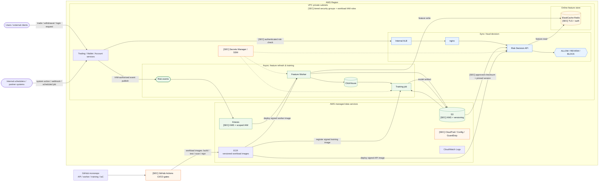

# Problem 5 — Fortify The Castle

This answer secures the Problem 1 design: a real-time fraud/risk decision service used
by trading, wallet, and account services before high-risk actions are committed.

The security priority is to protect the synchronous decision path without adding slow
network calls to it:

```text
Trading / Wallet / Account service
→ internal ALB
→ nginx
→ Risk Decision API
→ ElastiCache Redis
→ ALLOW / REVIEW / BLOCK
```

If the system cannot trust the caller, the features, the model artifact, or the runtime
state, it must fail to `REVIEW`, not `ALLOW`.

---

## Part 1 — Updated Architecture With Security Changes Marked

`[SEC]` marks only the security controls that materially change the architecture or a
trust boundary. Existing Problem 1 components stay unmarked even when their secure
configuration is described later.



The important security changes from Problem 1 are:

- tier-specific security groups and per-workload IAM roles reduce lateral movement and
  limit the blast radius of a compromised service,
- callers authenticate before risk decisions are accepted,
- the hot feature store and durable event/model stores use focused encryption and
  access controls,
- model artifacts require an approved checksum and pinned version before serving,
- managed secrets, AWS audit/detection services, and workload release gates cover the
  highest-value operational risks.

The internal ALB and private subnets are retained from Problem 1. They are important
baseline controls, but are intentionally not presented as new `[SEC]` components.

---

## Part 2 — Why Each Change Is There And What It Protects Against

This table maps one-to-one to the `[SEC]` markers in the diagram. Controls inherited
unchanged from Problem 1 are intentionally not repeated here.

| `[SEC]` marker | Where applied | What it protects against | Why this is the right level for this architecture |
|---|---|---|---|
| Tiered security groups + workload IAM roles | VPC workloads | lateral movement and one compromised workload accessing unrelated data or actions | Security groups restrict network paths by tier; separate IAM roles restrict AWS permissions by workload |
| Authenticated risk check | Product services to Risk API | forged requests from another workload inside the VPC | Use mTLS or short-lived signed service tokens; private IP alone is not service identity |
| ElastiCache TLS + auth | Risk API and worker access to Redis | feature exposure or unauthorized feature changes | Redis is in the decision hot path, so transport encryption and authenticated clients are mandatory without adding another proxy |
| Kinesis KMS + scoped IAM | Risk-event producers and consumers | event disclosure, unauthorized publishing, or unauthorized consumption | KMS protects stored events while producer/consumer roles enforce the stream boundary |
| S3 KMS + versioning | raw events and model artifacts | data exposure, accidental deletion, and model overwrite | S3 is the replay source and model store; encryption and recoverable versions protect both uses with managed controls |
| Secrets Manager / SSM | Risk API, worker, and training job | credentials or signing material stored in source, images, or CI logs | Workloads retrieve secrets through their IAM roles instead of carrying static credentials |
| Approved checksum + pinned model version | S3 model artifact to Risk API | model tampering, unreviewed model promotion, and ambiguous rollback | Serving references one approved S3 version and checksum, so promotion and rollback are explicit |
| CloudTrail / Config / GuardDuty | AWS account and security-relevant resources | unnoticed control-plane changes, configuration drift, and suspicious account or network activity | Managed detection provides useful coverage without introducing a separate SIEM platform for V1 |
| GitHub Actions CI/CD gates | Risk API, feature worker, training job, and IaC | vulnerable source, dependencies, images, secrets, or infrastructure changes reaching AWS | One shared minimum gate keeps releases consistent; only workload-specific tests differ |

GitHub versions source code, dependency manifests, deployment configuration, and IaC.
GitHub Actions builds a separate immutable image for each workload and stores it in
ECR; the Risk API, feature worker, and training job are all deployed by signed image
digest, not a mutable tag such as `latest`.

A monorepo is sufficient for this V1. Path filters run only the API, worker, training,
or IaC workflow affected by a change. The diagram shows the workload-image route to
ECR; IaC and nginx configuration use a separate validation and approval workflow and
do not pass through ECR.

| Deliverable | CI/CD responsibility | Release target |
|---|---|---|
| Risk API | test, scan, sign, deploy, run staging endpoint checks | ECR image digest to the Risk API service |
| Feature Worker | test feature calculations and stream integration, scan, sign, deploy | ECR image digest to the worker service |
| Training job | test training code and data contracts, scan, sign, register job version | ECR image digest to the batch/Spot job definition |
| Infrastructure and nginx configuration | validate IaC/config, policy scan, require production approval | AWS resources and nginx instances |
| Trained model | validate quality/security metadata, record checksum, approve and pin | Versioned S3 object consumed by the Risk API |

The repository versions the **training code**, not the trained model binary. A training
run produces a model in versioned S3; a separate promotion gate validates and approves
that artifact before the Risk API configuration points to its exact version and
checksum. This keeps code deployment and model promotion independently reversible.

| Gate | Example tools | Findings surfaced per | Blocks deployment when |
|---|---|---|---|
| Secret check | secret scanner | commit / pull request | real credential, private key, token, or signing secret is found |
| Source-code security check | code security scanner | changed workload in a pull request | critical/high issue is introduced in API, worker, or training code |
| Dependency check | dependency vulnerability scanner | each workload manifest and scheduled daily scan | critical/high reachable dependency issue exists with a fix or accepted mitigation missing |
| Container image check | image vulnerability scanner or ECR enhanced scanning | each workload image digest | critical/high OS or library vulnerability exists in the runtime image |
| Infrastructure check | IaC policy scanner | infrastructure pull request | public ingress, open security group, unencrypted data store, or broad IAM policy is introduced |
| Staging security check | automated staging endpoint scan | Risk API release candidate | exploitable auth, injection, or unsafe HTTP behavior is found |
| Release inventory | generated component inventory | each workload release artifact | a deployed image has no component inventory |
| Image signing | image signing service | each workload image digest | image is unsigned or digest does not match the approved build |

The pipeline should publish findings where the team works: PR checks for workload code
and IaC, findings on each ECR digest, staging security findings on the Risk API release
candidate, and deployment gates that accept only signed, scanned image digests.

Minimum controls I would refuse to ship without:

| Control | Reason |
|---|---|
| Tiered security groups and workload IAM roles | A compromised workload must not become an account-wide incident |
| Authenticated risk checks | A private subnet is not a service identity boundary |
| Redis TLS and authentication | Redis holds live features used by the fraud model |
| Kinesis and S3 KMS encryption with scoped access | Events and model artifacts are sensitive and replayable |
| Managed runtime secrets | Credentials must not be embedded in source or images |
| Approved, checksummed, pinned model artifacts | A tampered or bad model must be rejected or reversible immediately |
| Workload CI secret/code/dependency/image scanning | Obvious supply-chain issues should not reach the API, worker, or training environment |
| CloudTrail, Config, and GuardDuty enabled | Control-plane changes and suspicious activity need an investigation trail |

---

## Part 3 — What Is Deliberately Left Out And The Trade-Offs Accepted

| Left out | Trade-off accepted | Add when |
|---|---|---|
| Full service mesh | Avoids operating mesh control planes, sidecars, and policy complexity at 500 RPS | many internal services need consistent mTLS, identity, retries, and authorization policy |
| Active-active multi-region | Avoids high cost and complex data/model consistency problems | business RTO/RPO requires regional failover |
| WAF on Risk API | Risk API is internal only, so WAF adds little value on day one | a public risk endpoint or public API gateway is introduced |
| Managed ClickHouse | Single-node ClickHouse is cheaper and outside the hot path | analytics/backfill RTO becomes business-critical |
| MemoryDB | Redis feature state is rebuildable from Kinesis/S3 | feature state must survive full cache loss without replay |
| Dedicated SIEM/SOC platform | CloudTrail, GuardDuty, CloudWatch, and Grafana are enough for V1 | alert volume, compliance, or incident workflow requires a SIEM |
| Always-on production security scanning | Avoids noisy tests against money-adjacent systems | the team has mature test accounts, rate limits, and approved production scan windows |
| Manual penetration test in this challenge | Not realistic inside the challenge scope | before a real launch handling production money movement |
| Hardware-backed key management / HSM signing | KMS and image signing are enough for this stage | compliance or customer requirements demand HSM-backed signing |
| Fine-grained data tokenization platform | Data minimization and scoped access are the V1 controls | PII volume or regulation requires tokenization at scale |

Facts still needed before production sign-off:

| Unknown | How I would get it | Assumption used here |
|---|---|---|
| Exact PII in risk events | data inventory with product and data teams | events can be minimized and mostly use internal IDs |
| Regulatory requirements | compliance review | this service does not store PCI data or identity documents |
| RTO/RPO for risk decisions | business continuity review | single-region, multi-AZ is acceptable for V1 |
| Model approval process | risk/data-science review | model promotion requires approval, checksum, and rollback |
| Existing security operations process | security/on-call review | CloudWatch/GuardDuty alarms can route to an existing response path |

The accepted risk is mostly operational, not architectural: the system remains
single-region, ClickHouse is recoverable rather than highly available, and some advanced
security platforms are deferred. Those trade-offs are acceptable for a cost-conscious V1
because the synchronous fraud decision path remains private, authenticated, encrypted,
audited, and fail-closed to `REVIEW`.
